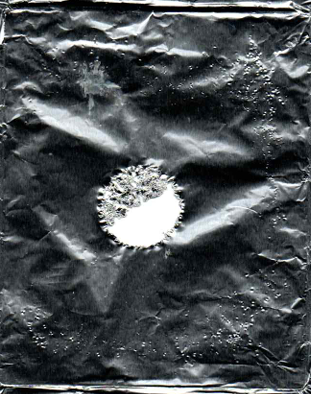
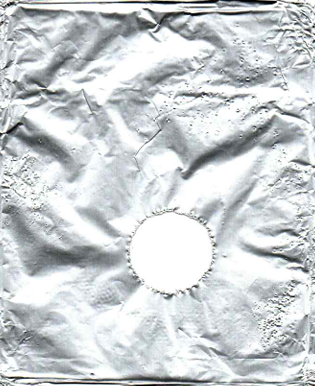
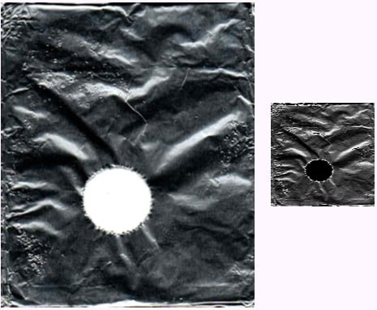
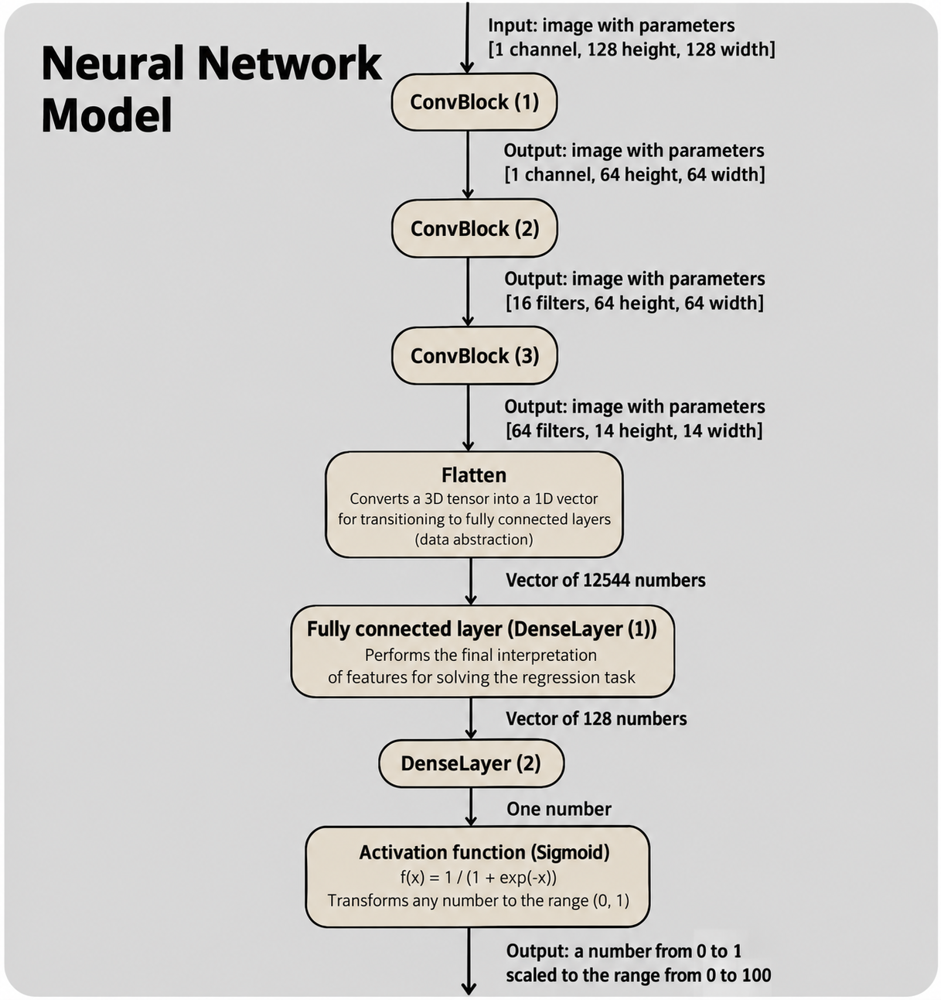
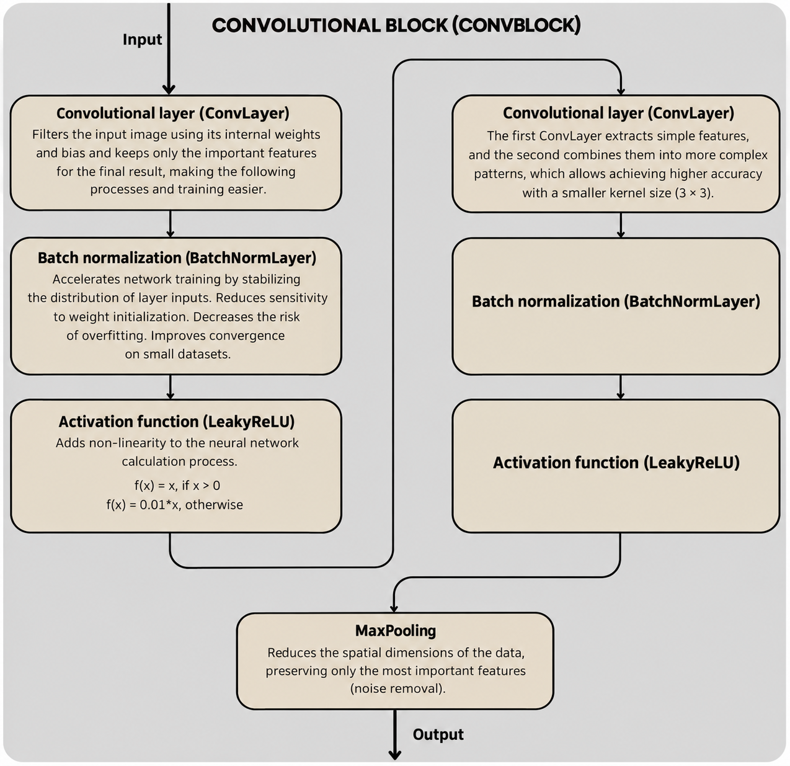
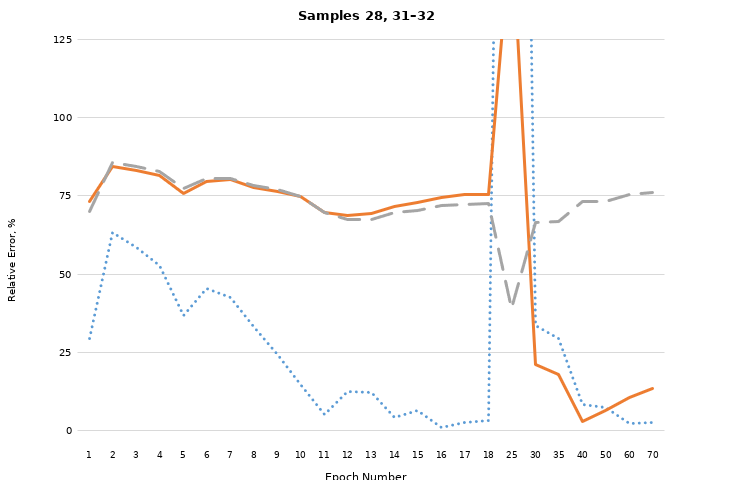

# Cavitation Erosion CNN

A Flutter/Dart research application for estimating the erosion coefficient of aluminum foil exposed to ultrasonic cavitation using a custom convolutional neural network implemented from scratch in Dart.

The project was developed as part of my bachelor's thesis, **“Application of Neural Network Technologies for Assessing the Erosive Action of Ultrasonic Cavitation”**. The research was also presented in the paper [*Application of Neural Network in Analysis Automation of Ultrasonic Cavitation Efficiency*](https://www.researchgate.net/publication/403370675_Application_of_Neural_Network_in_Analysis_Automation_of_Ultrasonic_Cavitation_Efficiency).

## Research Problem

Ultrasonic cavitation can be evaluated using an erosion test: an aluminum foil sample is exposed to cavitation and the resulting erosion is measured. The goal of this project was to automate the image-analysis part of that process.

The model predicts the **erosion coefficient**:

$$
\\varphi = \\frac{S_e}{S_t}
$$

where `Se` is the eroded area and `St` is the total foil area.

The reference coefficient was calculated manually using a `1 × 1 mm` grid. Cells that were more than half eroded were counted as fully eroded; cells with less than half of their area eroded were treated as non-eroded.

### Example samples

<div>
  
  
</div>

The two samples illustrate how strongly the visual appearance changes with the erosion coefficient.

## Dataset

The experimental dataset contained **32 aluminum foil samples** prepared under controlled ultrasonic-cavitation conditions.

- **27 samples** were used for training.
- **5 samples** were initially prepared for testing.
- The training set was divided into **three subgroups** with different distances between the foil and the ultrasonic sonotrode.
- Within each subgroup, cavitation exposure time ranged from **5 to 45 seconds** in 5-second increments.
- Two test samples had substantially different damage patterns and were excluded from the final reported test evaluation, leaving **3 test samples** for the final analysis.

The relatively small dataset is an important limitation of the experiment and is discussed in the thesis and paper.

## Image Preprocessing

The model does not train directly on the original RGB photographs. The preprocessing pipeline was designed to emphasize erosion-related visual structure while reducing unnecessary input dimensionality.

```text
RGB image
    ↓
HSV conversion
    ↓
Highlight filtering
    ↓
Value channel / grayscale
    ↓
128 × 128 resize
    ↓
Per-image normalization
```



Bright, low-saturation areas are filtered before the image is reduced to the HSV `Value` channel. The resulting grayscale image is resized to `128 × 128` and normalized using its mean and standard deviation.

## CNN Architecture

The neural network was implemented directly in Dart without using a dedicated machine-learning framework.

The model uses three convolutional blocks followed by dense layers:

```text
128 × 128 × 1
      ↓
ConvBlock 1: 1 → 16
      ↓
MaxPool
      ↓
ConvBlock 2: 16 → 32
      ↓
MaxPool
      ↓
ConvBlock 3: 32 → 64
      ↓
MaxPool
      ↓
Flatten (64 × 14 × 14 = 12,544)
      ↓
Dense 128
      ↓
Dense 1
      ↓
Sigmoid × 100
      ↓
Erosion coefficient [%]
```



Each convolutional block contains two convolutional layers followed by Batch Normalization and LeakyReLU activation, then MaxPooling.



The output layer uses a sigmoid activation and scales the result to the `0–100` range, turning the model into a regression predictor for the erosion coefficient.

## Training

The training pipeline was implemented manually, including both forward and backward passes.

The implementation includes:

- convolution and max-pooling operations;
- Batch Normalization;
- LeakyReLU and sigmoid activations;
- dense layers;
- backpropagation and gradient descent;
- mean-squared-error loss with an additional penalty for predictions outside `0–100`;
- gradient clipping;
- model serialization and deserialization to JSON.

The model can therefore be trained, saved, loaded again, and used for subsequent predictions without rebuilding the network from scratch.

## Results

The experiment demonstrated that a custom CNN implemented in Dart can learn to estimate the erosion coefficient from the foil images, while also exposing clear limitations caused by the small dataset.

In the reported test evaluation:

- the best result reached a **2.63% relative error** on one test sample;
- another test sample reached **13.29%** error;
- one sample remained a difficult outlier with much higher error, illustrating the model's limited generalization on poorly represented damage patterns;
- inference for one sample took **several seconds**.



The research concluded that increasing and balancing the dataset, especially for low-erosion cases, would be the main direction for improving generalization and accuracy.

## Research Context

The project was built as a software component of a broader experimental study of ultrasonic cavitation. The physical part of the work used aluminum foil samples exposed to cavitation in water with a laboratory ultrasonic system operating at approximately `22 kHz` and `630 W`.

The software connects the experimental measurement method with machine learning:

```text
Ultrasonic cavitation experiment
            ↓
      Eroded foil sample
            ↓
        Photograph
            ↓
     Image preprocessing
            ↓
       Custom CNN
            ↓
     Erosion coefficient
```

The broader research objective is to reduce the time required to evaluate foil-erosion measurements and provide a basis for further automation of cavitation analysis.

## Implementation Notes

Dart and Flutter were chosen so that the neural-network implementation and visualization could live in the same application rather than depending on an external Python service or ML runtime. The project therefore contains both the research UI and the numerical implementation of the model itself.

The repository is primarily a research/engineering prototype rather than a production ML framework. Its value is in the end-to-end implementation: dataset preparation, domain-specific preprocessing, a hand-written CNN, training, model persistence, and experimental evaluation.

## Tech Stack

- **Dart**
- **Flutter**
- **Dart math / numerical operations**
- **`image` package** for image processing
- **Custom CNN implementation**
- **JSON model serialization**

## Running the Project

The project is a Flutter desktop application. With the complete Flutter project available:

```bash
flutter pub get
flutter run -d windows
```

The application is intended for loading the prepared foil-image samples, training or loading the model, and inspecting predictions and errors.

## Research Publication

**Application of Neural Network in Analysis Automation of Ultrasonic Cavitation Efficiency**  
Alena A. Vjuginova, Dmitry I. Ivanov, Anton Bunakov

[View the paper on ResearchGate](https://www.researchgate.net/publication/403370675_Application_of_Neural_Network_in_Analysis_Automation_of_Ultrasonic_Cavitation_Efficiency)
